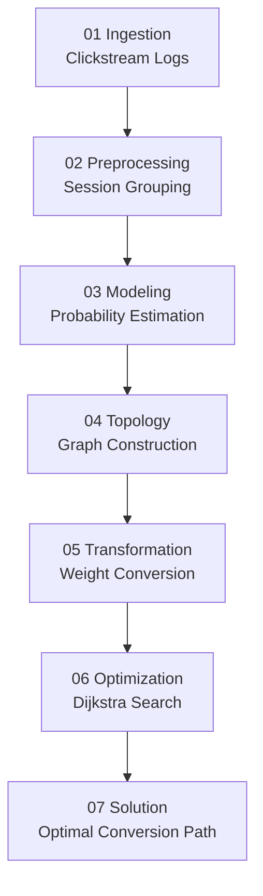

# Customer Journey Path Optimization (Graph Algorithms + Data Mining)

## 📌 Project Overview
This project addresses a **probabilistic path optimization problem** on directed graphs derived from customer journey data. Using interactions modeled as a directed graph $G=(V,E)$, we transform transition probabilities $p(u,v)$ into non-negative weights using:
$$w(u,v) = -\log(p(u,v))$$

This allows us to apply **Dijkstra’s Algorithm** to find the most probable conversion path while avoiding numerical underflow.

## 📁 Project Structure

```
code/
├── data/
│   ├── synthetic_data_generator.py
├── src       
│   ├── preprocessing.py
│   ├── graph_builder.py
│   ├── dijkstra.py
├── analysis.py
├── main.py
├── requirements.txt
├── README.md 
```

## ⭐ Usage

1. Install dependencies:

```bash
pip install -r requirements.txt
```

2. Run the algorithm:

```bash
python main.py
```

This will 
1. Load the clickstream dataset
2. preprocess session transitions
3. Build the directed graph
4. Run Dijkstra's algorithm
5. Print the most probable customer journey path

3. Specify dataset and start/end nodes
```bash
python main.py --data data/clickstream.csv --source Home --target Checkout
```

Example output:

```
Optimal Path:
Home → Search → Product → Cart → Checkout

Total Cost: 2.41
```

4. Compute top-k most probable paths
```bash
python main.py --data data/clickstream.csv --source Home --target Checkout --k 3
```

Example output:

```
Top 3 Paths:
1. Home → Search → Product → Cart → Checkout (Cost: 2.41)
2. Home → Search → Product → Product → Cart → Checkout (Cost: 2.68)
3. Home → Search → Product → Product → Product → Cart → Checkout (Cost: 2.95)
```

5. Export graph visulization
```bash
python main.py --data data/clickstream.csv --source Home --target Checkout --k 3 --output output.png
```

## 🔄 Pipeline


The pipeline converts probabilistic user transitions into a weighted directed graph where Dijkstra's algorithm can efficiently identify the most probable conversion path.

### Algorithm Complexity

Let:
V = number of nodes
E = number of edges

Dijkstra's algorithm runs in:

O((V + E) log V)

using a priority queue.

## 📊 Dataset
The datasets are generated using `synthetic_data_generator.py` script for testing the algorithm. Created using Markov-chain based datasets mimicking the structure of real customer life cycle flow path. 

### Synthetic Data
- **Source:** Generated using `synthetic_data_generator.py`
- **Description:** Markov-chain based clickstream data with features: `session_id`, `step`, `timestamp`, `location`, `source`, `target`, `category`, `price`, `is_high_price`
- **Size:** 2000 sessions, ~20,000 rows

## 🚀 Methodology

### Overview
The project aims to find the most probable conversion path from a source node to a target node in a weighted directed graph. The graph is built from clickstream data, where nodes represent user states (e.g., product pages, search results) and edges represent transitions between states. The weight of each edge is calculated as the negative logarithm of the transition probability, i.e., $w(u,v) = -\log(p(u,v))$. This transformation allows us to use Dijkstra's algorithm to find the shortest path, which corresponds to the most probable conversion path.

### analysis.py
- Analyzes clickstream data to extract transition probabilities between nodes.
- Groups sequences by `session_id` and calculates transition frequencies.
- Returns transition probabilities, raw transition counts, and aggregated frequency statistics.
- Convert probabilities into a directed graph. 

### dijkstra.py
- Implements Dijkstra's algorithm to find the optimal customer journey path from a source node to a target node in a weighted directed graph.
- Uses a priority queue to efficiently explore the graph and find the shortest path.
- Returns the shortest distance and the path from the source to the target.

### graph_builder.py
- Builds a weighted directed graph from clickstream data.
- Calculates transition probabilities between nodes and converts them to edge weights using the formula $w(u,v) = -\log(p(u,v))$.
- Returns an adjacency list representation of the graph.

### preprocessing.py
- Preprocesses clickstream data to extract transition probabilities between nodes.
- Groups sequences by `session_id` and calculates transition frequencies.
- Returns transition probabilities between nodes.

### main.py
- Main script to run the algorithm.
- Loads clickstream data, builds the graph, and finds the shortest path from source to target.
- Prints the shortest path and the total weight of the path.